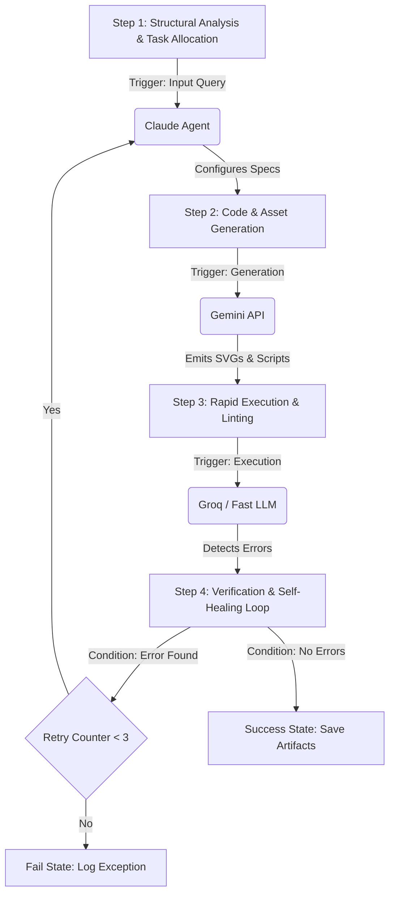

# 🌟 HEAVENLY EXECUTION HARNESS: SVG ANIMATION & LEARNER LICENCE WEBSITE

<!-- PERMISSION: READ-ONLY (ALL) -->
## 🗺️ 1. WORKFLOW & DIRECTED ACYCLIC GRAPH (DAG)



---

<!-- PERMISSION: READ-ONLY (ALL) -->
## 🛠️ 2. AGENT WRITE-PERMISSION BOUNDARIES

- **CLAUDE_SON**: Exclusive write permissions on task configuration, allocation tables, self-healing orchestration plans.
- **GEMINI_CODE**: Exclusive write permissions on SVG code structures, animations, Python automation generators, and documentation indexing.
- **GROQ_FAST**: Exclusive write permissions on runtime verification logs, unit tests, code linting summaries, and compiler outputs.

---

<!-- PERMISSION: WRITE-ONLY (CLAUDE_SON) -->
## 🧠 Agent Reasoning Log [CLAUDE_SON]
- **Current State:** Initialization of target platform.
- **Assigned Objective:** Orchestrating South African National Road Traffic Act schemas and SVG web animations.
- **Reasoning Process:** Analyzed available knowledge constraints and defined baseline template.

---

<!-- PERMISSION: WRITE-ONLY (GEMINI_CODE) -->
## 📦 Artifact Output Area [GEMINI_CODE]

### 🇿🇦 SADC Traffic Sign SVG Specifications Placeholder
```xml
<!-- PLACEHOLDER FOR SOUTH AFRICAN ROAD SIGN WARNING W202/W204 SERIES -->
<svg xmlns="http://www.w3.org/2000/svg" viewBox="0 0 100 100" width="100%" height="100%">
  <!-- Red triangular border -->
  <polygon points="50,5 95,85 5,95" fill="white" stroke="red" stroke-width="8"/>
  <!-- Custom sign symbol goes here -->
</svg>
```

### 📘 South African National Road Traffic Act Schema Placeholder
- **Regulations:** Chapter IX (Learner's and Driving Licences)
- **Code B Specifications:** Light Motor Vehicles (< 3500kg)
- **Code EC Specifications:** Heavy Articulated Vehicles / Code 14

---

<!-- PERMISSION: WRITE-ONLY (GROQ_FAST) -->
## 🚨 Exception & Error Capture [GROQ_FAST]
```text
[LINT_STATUS]: PENDING INITIAL EXECUTION
[RUNTIME_EXCEPTION]: NONE DETECTED
```

---

<!-- PERMISSION: WRITE-ONLY (CLAUDE_SON) -->
## 🔄 Self-Healing Action Items [RETRY_COUNTER: 0/3]
1. Validate SADC SVG structures against the schema parser.
2. Ensure total processed token output remains within defined limits.
3. Execute tests on generated SADC warning signs.

---

<!-- PERMISSION: READ-ONLY (ALL) -->
## 📊 3. SYSTEM & TOKEN LIMIT QUOTA SPECIFICATIONS
- **Context Windows:** Optimizing for 1M+ inputs under Gemini 1.5/2.5 series constraints.
- **Rate Limiting:** Throttle requests backoff minimum 2.5 - 3.0 seconds during high-frequency API invocations to prevent HTTP 429 exceptions.


<!-- PERMISSION: READ-ONLY (ALL) -->
## 📔 APPENDIX: KNOWLEDGE COMPRESSION AREA

### Combined Master Knowledge Feed Summary
# 📚 ULTIMATE MASTER KNOWLEDGE BUNDLE & PROJECT COMPENDIUM

---

## 📑 TABLE OF CONTENTS
1. [AI Model Input/Output Token & Context Specifications](#1-ai-model-inputoutput-token--context-specifications)
2. [Combined Repositories & Software Codebase Architecture](#2-combined-repositories--software-codebase-architecture)
3. [Master Chat Compilation & Interaction History](#3-master-chat-compilation--interaction-history)
4. [Ernie's Driving School & Traffic Standards Curated Bundle](#4-ernies-driving-school--traffic-standards-curated-bundle)

---


## 1. AI MODEL INPUT/OUTPUT TOKEN & CONTEXT SPECIFICATIONS

> **Source File:** `/content/AI Model Input Output Limits.md`

# **AI Model Input Output Limits**

[https\://gemini.google.com/app/674117127cd5315c](https://gemini.google.com/app/674117127cd5315c)

*User prompt: Can you give me an markdown file of the input and output limits of every public accessible ai at the moment which I want to use to build an highly optimised Markdown file to give as context to solve an problem?*

Response: I will now generate a comprehensive Markdown file detailing the current input and output limits for major publicly accessible AI models and platforms as of 2026\.

---

*User prompt: This is all the free tier and llm with an daily token limit?*

Response: Yes, the previous document focuses specifically on the **developer API tiers** (and standard enterprise ceilings) where token consumption, requests per minute (RPM), and daily or monthly limits are explicitly governed by programmatic quotas.

To help you build that optimized Markdown context file for problem-solving, it helps to separate these limits into two distinct buckets: **Free Developer API Tiers** (which have strict daily/minute rate-limiting caps) versus **Consumer Web Apps** (which use rolling session windows).

Here is the breakdown of how free tiers and daily token limits operate across the major providers:

### **1\. Developer APIs with Free Tiers / Explicit Daily & Rate Limits**

> * **Google Gemini API (Google AI Studio)**  
  * *Model Focus:* Gemini Flash / Flash-Lite series.  
  * *Limits:*  
    * **Gemini Flash:** 10 Requests Per Minute (RPM), 250,000 Tokens Per Minute (TPM), and **1,500 Requests Per Day (RPD)**.  
    * **Context Window:** Up to 1 Million tokens.  
  * *Verdict:* This is currently the most generous persistent free tier for programmatic workflows or agents, allowing substantial daily throughput without a credit card.  
> * **Groq API**  
  * *Model Focus:* Open-weights models (Llama, Mistral, Qwen variants).  
  * *Limits:* Around **30,000 Tokens Per Minute (TPM)** and up to **14,400 Requests Per Day (RPD)** depending on the specific model endpoint.  
  * *Verdict:* Exceptional for high-speed automated loops where latency and speed are the primary constraints.  
> * **Mistral AI (La Plateforme \- Evaluation Tier)**  
  * *Model Focus:* Mistral NeMo, Small variants.  
  * *Limits:* Rate-limited to roughly 1 request per second (\~30 requests per minute) for evaluation, requiring migration to pay-as-you-go for production traffic.  
> * **OpenAI & Anthropic APIs**  
  * *Limits:* **No perpetual free tier.** New accounts receive a one-time trial credit (\$5) that typically expires after 3 months. Once exhausted, access requires funding a prepaid balance (OpenAI utilizes usage tiers starting at Tier 1 where limits scale with cumulative spend).

### **2\. Consumer Web Platforms (Daily & Rolling Limits)**

If you are interacting with web chats (like ChatGPT, Claude, or DeepSeek) rather than writing direct API code, the limits function differently:

> * **ChatGPT (Free vs. Plus)**  
  * Free tier grants access to flagship models with dynamic rolling limits (typically constrained to a handful of messages every few hours depending on global server load).  
> * **Claude.ai (Anthropic)**  
  * *Free Web Tier:* Grants limited access to standard models (e.g., Sonnet variants) constrained by a rolling 5-hour window rather than a strict static daily count. Heavy prompts with multiple file uploads exhaust the window much faster than short text queries.  
> * **DeepSeek Web App**  
  * Provides access via a free chat interface with dynamic operational caps (historically around \~50 messages per day on advanced reasoning modes under high load).

### **Strategy for Your Optimization Context File**

When crafting your Markdown context file for solving complex problems across models, structure your constraints around these three tiers to prevent agentic loops from throwing 429 Too Many Requests errors:

> 1. **High-Volume / Heavy Context Operations:** Route to **Google Gemini Flash** (leveraging the 1M+ token window and 1,500 RPD free allowance).  
> 2. **High-Speed / Low-Latency Execution:** Route to **Groq** for open-weights models.  
> 3. **Deep Reasoning / Fallback:** Reserve paid or trial API credits (OpenAI/Anthropic/DeepSeek) strictly for complex logic gates where smaller models fail.

**Sources**

> 1. [Gemini API Free Tier 2026: Gemini 3 Flash Limits, Quotas](https://pecollective.com/tools/gemini-free-tier-guide/)  
> 2. [Groq Free Tier 2026: Fastest LLM Inference API (No Credit Card)](https://www.getaiperks.com/en/ai/groq-free-tier-2026)  
> 3. [Free AI API Keys in 2026: Every Provider, Every Free Tier Compared](https://admix.software/blog/free-ai-api-keys-master-guide-2026)  
> 4. [OpenAI API Rate Limits in 2026 \- Standard Compute](https://standardcompute.com/rate-limits/openai)  
> 5. [Claude Pricing in 2026: Free vs Pro vs Max \- AItomation Academy](https://www.aitomationacademy.com/blog/is-claude-ai-free-pricing-guide)  
> 6. [DeepSeek Pricing 2026: Subscription, API Costs & Free Credits](https://www.getaiperks.com/en/ai/deepseek-pricing-free-credits)

---

*User prompt: If you want to plan an advance project to create an markdown file what parameters would you need to plan in advance? We talked about the input, output Max, How many messages per day and each models strength. What else would you need?*

Response: To successfully design a multi-model orchestration framework or an automated pipeline where multiple LLMs work together to solve a complex problem, input/output limits and daily caps are only the starting point.

If you want to plan an advanced project and map out a Markdown file or architecture blueprint that avoids bottlenecks, failures, or unexpected bills, you need to track several more critical operational parameters:

### **1\. Throughput & Velocity Parameters (The Speed Gate)**

> * **Requests Per Minute (RPM) & Tokens Per Minute (TPM):** Daily limits tell you how much work a model can do *in total*, but RPM/TPM dictates **how fast** your scripts can talk to it. If an agentic loop fires off 10 sub-tasks simultaneously, it will instantly trigger a 429 Too Many Requests error on strict TPM ceilings, even if you’ve barely touched your daily allowance.  
> * **Inference Speed (Tokens Per Second \- t/s):** Crucial if you are using open-weights models on platforms like Groq versus reasoning models (like OpenAI o-series or DeepSeek-R1 variants) which spend significant time "thinking" (generating internal reasoning tokens) before outputting text.

### **2\. Economic & Cost Structures (The Survival Metric)**

> * **Input vs. Output Cost Discrepancy:** Output tokens are almost always drastically more expensive than input tokens (frequently 3x to 5x higher). If your project involves generating long blocks of code or deep text synthesis, your cost model shifts entirely.  
> * **Long-Context Surcharges / Tiers:** Some providers change pricing models once you cross a specific threshold (e.g., doubling input costs above 200K tokens).  
> * **Prompt Caching Economics:** Platforms like Anthropic, OpenAI, and Gemini offer prompt caching (discounting tokens that are re-sent in conversation history). Knowing if a model supports caching changes how you structure your markdown context files.

### **3\. State & Context Architecture (The Memory Limit)**

> * **Effective Context Window vs. Advertised Window:** Just because a model claims a 1M or 2M token window doesn’t mean it maintains 100% retrieval accuracy at the tail end. Tracking "Lost in the Middle" degradation metrics helps you decide whether to use RAG (Retrieval-Augmented Generation) or raw full-context dumping.  
> * **Compounding History Bloat:** In automated loops or agent workflows, the conversation history is re-sent on *every single tool call*. A session that starts small can easily balloon to 150K+ tokens by the 20th turn, burning through rate limits exponentially.

### **4\. Reliability & Governance (The Fail-Safe Layer)**

> * **Fallback & Routing Logic:** If Model A hits its daily cap or throws a 429 error, what is the automated fallback path? Your project plan needs a hierarchy (e.g., *Primary: DeepSeek/Claude \-\> Fallback: Gemini Flash \-\> Emergency: Local Model*).  
> * **Structured Output Support (JSON Mode / Tool Calling):** Not all models handle strict schema enforcement equally well. If your pipeline relies on models outputting clean JSON to pass data to the next step, you must log which models natively support reliable function calling.

### **Suggested Addition to Your Markdown Matrix**

When you build your master Markdown file, consider adding columns or sections for:

> 1. **RPM / TPM Limits** (to protect against concurrency crashes).  
> 2. **Reasoning / Latency Profile** (instant response vs. heavy "thinking" delay).  
> 3. **Primary Failure Mode** (e.g., "Hits daily RPD fast" vs. "Hits TPM under heavy loops").  
> 4. **Assigned Pipeline Role** (e.g., Heavy Context Ingestion, Rapid Code Generation, or Final Validation).

Would you like to draft the template structure for this master orchestration file?

**Sources**

> 1. [LLM Context Window Comparison (2026): 20 Models From 200K to](https://www.morphllm.com/llm-context-window-comparison)

---

*User prompt: Can I get all this information via the api of the llm?*

Response: **Yes and 

... [TRUNCATED FOR COMPRESSION] ...